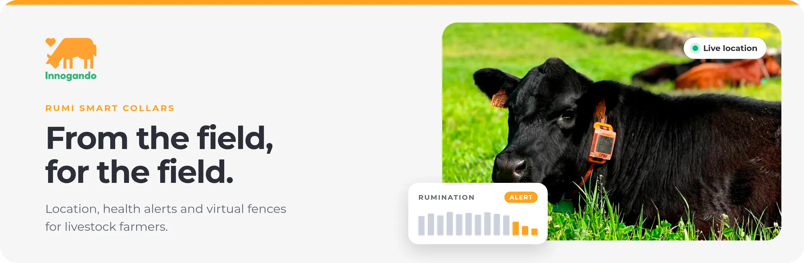

  

> Innogando makes **Rumi**, a smart collar for cattle. It tells a farmer where each animal is and how each animal is doing, often on land with no mobile coverage. We build the full chain in house: the collar, its firmware, the radio network, the data platform, the models and the app.

 

<table>
<tr>
<td align="center" width="33%"><h3>40K+</h3>animals wear a Rumi collar today</td>
<td align="center" width="33%"><h3>3.5M+</h3>GPS positions every day</td>
<td align="center" width="33%"><h3>1,500+</h3>farms use Rumi in the field</td>
</tr>
</table>

 

### [WHAT WE WORK ON]

**Data from where there is no coverage.** Our collars work on mountain pastures, far from any mobile network. They send data over LoRaWAN, and Rumi PRO can also use LTE. They run on solar power for the full grazing season.

**Behaviour from a sensor on the neck.** The collar knows when a cow eats, ruminates, walks or rests. A drop in rumination is often the first sign of illness. A change in activity can show heat or calving. We turn these signals into alerts, often before the farmer can see a symptom.

**Fences without posts.** With Rumi PRO, the farmer draws a fence on a map. When a cow comes near the line, her collar plays a sound. If she keeps walking, she gets a low-power correction. Most animals learn the boundary in 4 to 7 days.

**Alerts a farmer can trust.** A farmer who gets false alarms stops reading them. Each alert we send must be worth a trip to the field.

 

### [OPEN SOURCE]

Most of our code is private. We keep public forks of the firmware libraries that our collars use, and we fix them there when we need to:

- **[ubxlib](https://github.com/Innogando/ubxlib):** u-blox libraries for GNSS and cellular modules.
- **[usp_zephyr](https://github.com/Innogando/usp_zephyr):** Semtech's Unified Software Platform and LoRa Basics Modem on Zephyr.
- **[LBM_Zephyr](https://github.com/Innogando/LBM_Zephyr):** LoRa Basics Modem integration in Zephyr OS.

 

### [JOIN US]

Our code runs on 40,000 animals and on the phones of the farmers who look after them. If you want to work on that, write to us at [hola@innogando.com](mailto:hola@innogando.com).

Born in Galicia, Spain. Now expanding abroad.

